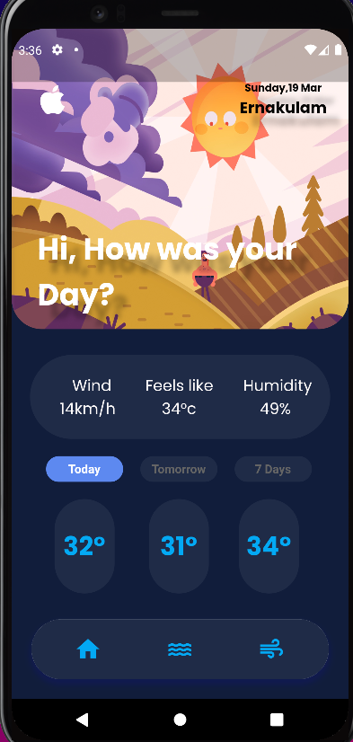

# InhaLake
TEAM NAME:MARK 10

DOMAIN:OPEN INNOVATION

PROBLEM STATEMENT 
	:In a scenario where pollution of all kinds (especially air and water pollution) are increasing rapidly.
	:There is no viable 	solution or product to measure the quality indexes of air and water in our homes portably ,convineientlyand cheaply

SOLUTION 
	:Our product is a portable hardware and a mobile application that can be used to accurately monitor and report real-time air 	 and water quality of the location where hardware is kept.

HARDWARE COMPONENTS USED
	:TDS SENSOR
	:TURBIDITY SENSOR
	:MQ135-Air Quality Index
	:ESP 8266
	:ARDUINO UNO (its used as a power source temporarily)
	
STACKS USED
	:FLutter
	:FIrebase
	:C++ for arduino coding

WORKING
	:Hardware Unit sents AQI,AWI and CO2,LPG,NO,CO,turbidity..... data's to tinkspeak
	:tinkspeak act as an service that allows you to see real time datas with read and write API keys
	:using this API we connected it to APP ui.
	:the app which uses firebase authentication to allow users get all information easily
 

UI AND HARDWARE

